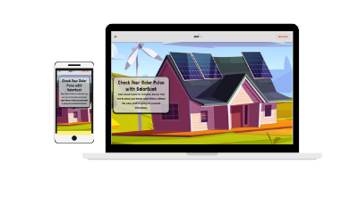

# Solar-Beat Front End React Page

## Overview

A landing page with a built in Solar Energy savings estimator based on bill price at current average rates, and a contact form that sends inquiries.  This fully responsive webpage was built for a company I had started and am not actively persuing anymore.  

Deployed site - https://solar-beat.com/

## Technologies Used

The main reason for this build was to practice using Material UI.  This site is built with React, Material UI, and Email JS.  I made a theme providor using Material UI to set the colors, font families, and font sizes.  I also used useState to perform form validations.  

## Contributors

I am the sole contributor of this project.

## Installation 

Clone repository and run npm i to install dependancies.  Start Application with npm start.

## Future Development

If I was to get back into the Solar Business, I would swap out my icons and images with paid for professional ones.  I would also add a database to hold all of the products and installers available and create a portal for users who want a quote to log in, recieve quotes, check status on projects, and sign documents all independantly.  Essentially like carfax for solar. 
